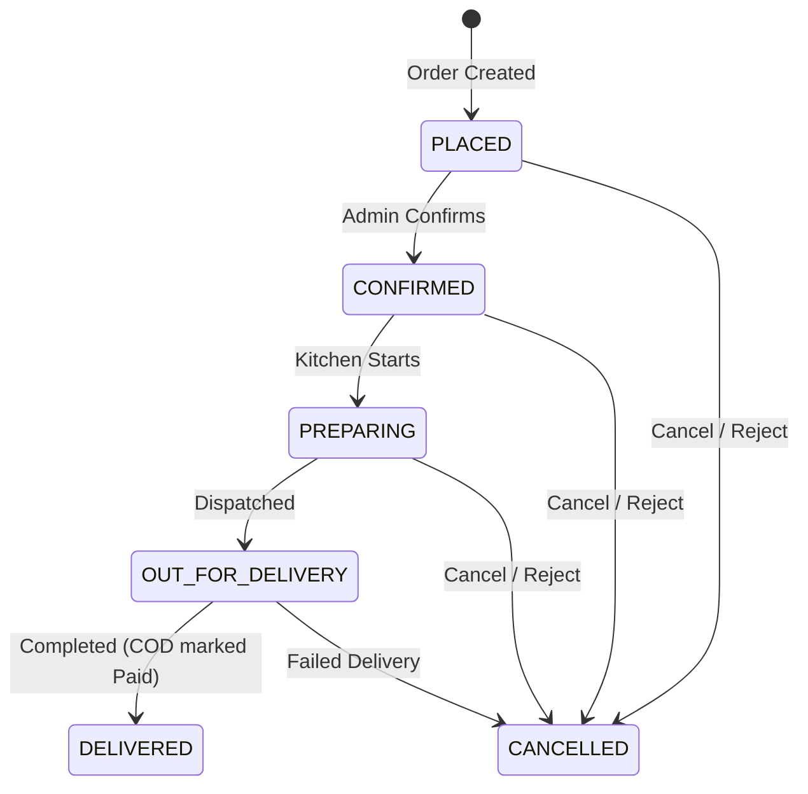

# ForkLane 🍴 — Food Delivery Platform

[](https://reactjs.org/)
[](https://nodejs.org/)
[](https://www.mongodb.com/)
[](https://stripe.com/)
[](https://jwt.io/)
[](https://opensource.org/licenses/MIT)

> **Good Food. No Wait.** — A full-stack MERN food delivery platform featuring a customer storefront, real-time order tracking, Stripe payments, and a dedicated admin management portal.

---

## 📌 Project Overview

**ForkLane** is an end-to-end food ordering and delivery ecosystem built with the MERN stack (MongoDB, Express, React, Node.js). It comes complete with two responsive frontends (Customer Storefront + Admin Panel) and a secure REST API backend.

```
forklane/
├── backend/     # Express.js REST API + MongoDB (Port 5000)
├── client/      # Customer Storefront — React + Vite (Port 5173)
└── admin/       # Admin Management Portal — React + Vite (Port 5174)
```

---

## ✨ Features

### 🛒 Customer Storefront (`/client`)
- **Food Discovery**: Interactive catalog with category filters, dynamic search, and dish detail pages.
- **Cart & Order Flow**: Dynamic cart drawer/page, quantity adjustments, and live price recalculation.
- **Stripe & COD Checkout**: Secure card payments powered by Stripe alongside Cash on Delivery options.
- **Live Order Tracking**: Visual progress bar tracking order statuses from `Placed` to `Delivered`.
- **User Authentication**: JWT-based authentication with protected profile and order history pages.

### 🛠️ Admin Management Portal (`/admin`)
- **Executive Dashboard**: KPI metrics, sales revenue summaries, total orders, and product count.
- **Product Management**: Full CRUD operations with image uploads (via Multer), category assignments, and pricing.
- **Live Order Management**: Real-time order status advancement pipeline (`Placed` ➔ `Confirmed` ➔ `Preparing` ➔ `Out for Delivery` ➔ `Delivered`) and order cancellation with automated Stripe refund support.
- **Secure Admin Auth**: Role-based access control with secret-key guarded admin registration.

### ⚙️ REST API Backend (`/backend`)
- **Robust MVC Architecture**: Modular routes, controllers, middleware, and models.
- **Security & Validation**: Bcrypt password hashing, JWT authorization middleware, and central error handling.
- **Automated Seeding**: Ready-to-use seed script to populate sample food items and admin credentials.

---

## 🛠️ Tech Stack

| Layer | Technologies |
|---|---|
| **Frontend (Client & Admin)** | React 18, Vite, React Router DOM v6, React Context API, Lucide Icons |
| **Styling** | Vanilla CSS (Bespoke design system: Inter & Bebas Neue typography) |
| **Backend API** | Node.js, Express.js |
| **Database & ODM** | MongoDB, Mongoose |
| **Authentication** | JSON Web Tokens (JWT), Bcrypt.js |
| **Payments** | Stripe API |
| **File Storage** | Multer (Local disk upload pipeline) |
| **Notifications** | React Hot Toast |

---

## 🚀 Quick Start Guide

### Prerequisites
- [Node.js](https://nodejs.org/) (v16+ recommended)
- [MongoDB](https://www.mongodb.com/) (Local instance or MongoDB Atlas URI)
- [Stripe Account](https://stripe.com/) (For API keys)

---

### 1. Backend Setup

```bash
cd forklane/backend

# 1. Install dependencies
npm install

# 2. Configure environment
cp .env.example .env
# Edit .env and supply your MONGO_URI, JWT_SECRET, and STRIPE keys

# 3. (Optional) Seed demo data & admin user
npm run seed

# 4. Start backend server
npm run dev
# Server running at http://localhost:5000
```

---

### 2. Customer Frontend Setup

```bash
cd forklane/client

# 1. Install dependencies
npm install

# 2. Configure environment
cp .env.example .env

# 3. Start development server
npm run dev
# App running at http://localhost:5173
```

---

### 3. Admin Panel Setup

```bash
cd forklane/admin

# 1. Install dependencies
npm install

# 2. Configure environment
cp .env.example .env

# 3. Start development server
npm run dev
# Admin dashboard running at http://localhost:5174
```

---

## 🔐 Environment Variables

### Backend (`forklane/backend/.env`)
```env
PORT=5000
MONGO_URI=mongodb://localhost:27017/forklane
JWT_SECRET=your_super_secret_jwt_key
JWT_EXPIRE=7d
STRIPE_SECRET_KEY=sk_test_your_stripe_secret_key
ADMIN_REGISTER_SECRET=your_admin_registration_secret
CLIENT_URL=http://localhost:5173
ADMIN_URL=http://localhost:5174
SEED_ADMIN_EMAIL=admin@forklane.com
SEED_ADMIN_PASSWORD=adminpassword123
```

### Client (`forklane/client/.env`)
```env
VITE_API_URL=http://localhost:5000
VITE_STRIPE_PUBLISHABLE_KEY=pk_test_your_stripe_publishable_key
```

### Admin (`forklane/admin/.env`)
```env
VITE_API_URL=http://localhost:5000
```

---

## 🔄 Order Lifecycle Flow



---

## 📡 API Reference Overview

| Endpoint | Method | Access | Description |
|---|---|---|---|
| `/api/auth/register` | `POST` | Public | Register new customer |
| `/api/auth/register-admin` | `POST` | Public + Secret | Register administrator |
| `/api/auth/login` | `POST` | Public | Authenticate user & issue JWT |
| `/api/auth/profile` | `GET` / `PUT` | Private | Retrieve or update user profile |
| `/api/products` | `GET` | Public | List products (filterable by category/search) |
| `/api/products` | `POST` | Admin | Create new food item |
| `/api/products/:id` | `PUT` / `DELETE`| Admin | Update or delete food item |
| `/api/products/upload-image` | `POST` | Admin | Upload product food image |
| `/api/orders` | `POST` / `GET` | Private | Create order / Get user orders |
| `/api/orders/:id` | `GET` | Private | Get single order details |
| `/api/orders/:id/status` | `PUT` | Admin | Advance order status in lifecycle |
| `/api/orders/:id/cancel` | `PUT` | Admin | Cancel order and refund payment |
| `/api/dashboard/stats` | `GET` | Admin | Fetch analytics and overview stats |

---

## 📄 License

This project is licensed under the [MIT License](LICENSE).
